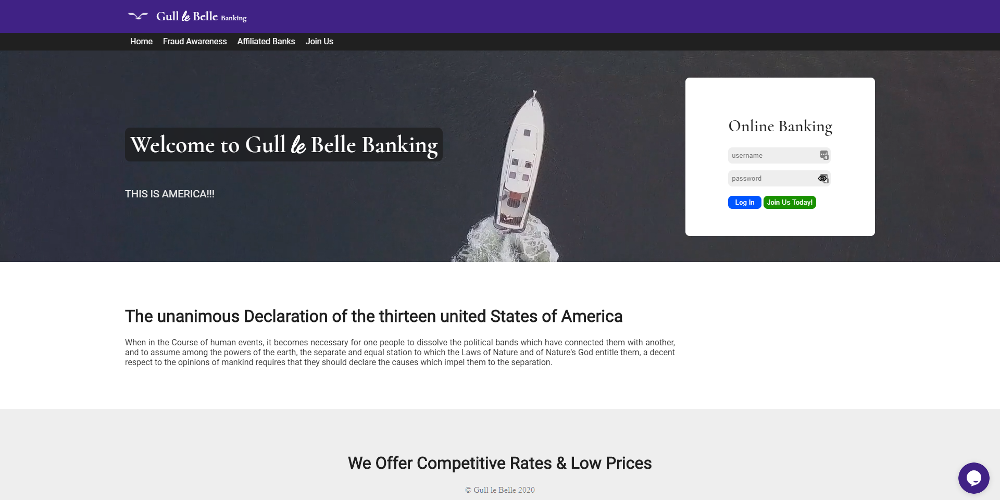
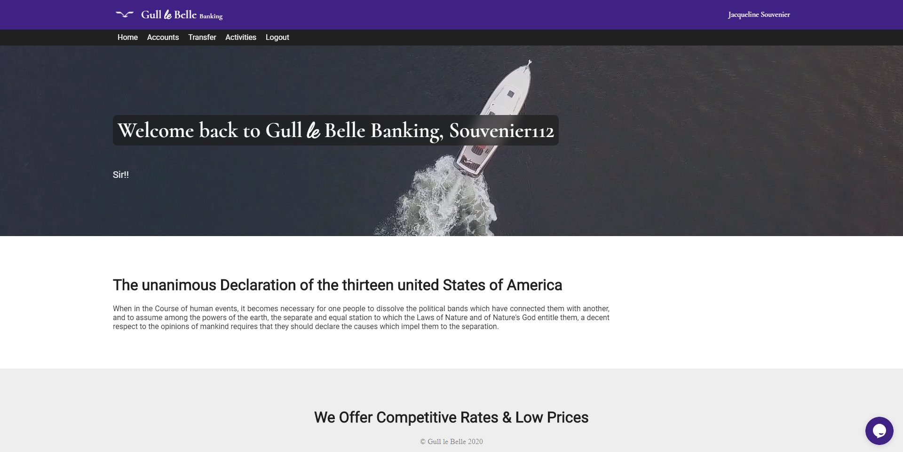
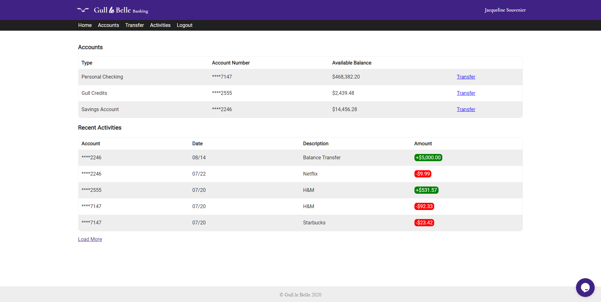
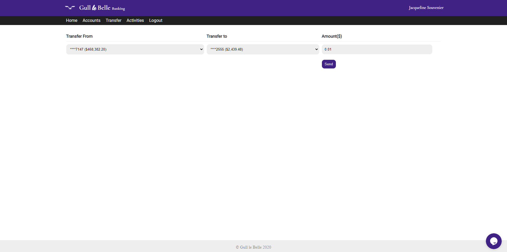
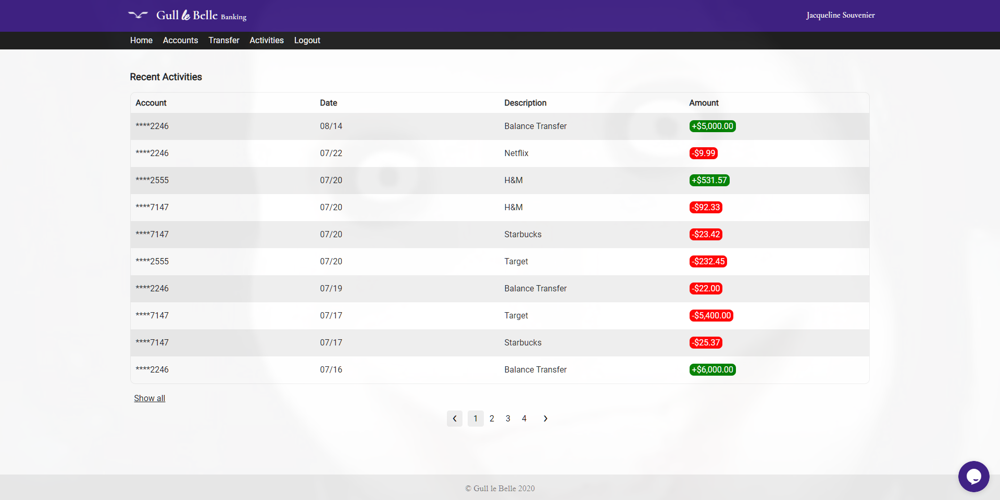

# Documentation
## About
A fake banking website for scambaiting copied as close to Kitboga's , "Gull and Bull", as possible.

## Disclaimer
Please only use this for scambaiting or personal means that do not hurt anyone. Do not publish this anywhere, keep it on your computer or VM only. The government knows each and everything.

## Features
* Fake bank account sign up
* Transfer between accounts
* Disabled inspect on account information page (still accessible through other pages)
* Session inactivity timeout (15 minutes)
* Recent activities
* Creepy face show up from time to time

## Features to add
* External account transfer
* Any other features I can think of

## Screenshots
### Home page

### Logged in home page

### Account page

### Transfer page

### Activities page


## How to setup
### This instruction is for windows users, although the steps are mostly the same.
1. Install [XAMPP](https://www.apachefriends.org/index.html).
2. Download [GullleBelle-master.zip](https://github.com/lahrence/GullleBelle/archive/master.zip).
3. Go to `C:\xampp\htdocs` (or wherever your htdocs folder is) and delete all the files/folders.
4. Unzip the `GullleBelle-master.zip` and drag the folder into the htdocs folder.
5. Rename the folder to `GullleBelle` instead of `GullleBelle-master`.
6. In the XAMPP control panel, start 'MySQL' and 'Apache'.
7. Go to [phpmyadmin](http://localhost/phpmyadmin/) (this link will only work if you have MySQL started).
8. Create a new database called 'gulllebelle'.
9. After the database is created, go to the SQL tab and copy this into the text area.
```
CREATE TABLE `users` (
  `idUsers` int(11) AUTO_INCREMENT KEY NOT NULL,
  `uidUsers` tinytext NOT NULL,
  `emailUsers` tinytext NOT NULL,
  `pwdUsers` longtext NOT NULL,
  `firstname` text NOT NULL,
  `lastname` text NOT NULL,
  `chckAcc` decimal(18,2) DEFAULT NULL,
  `savAcc` decimal(18,2) DEFAULT NULL,
  `credits` decimal(18,2) DEFAULT NULL,
  `chckNum` tinytext NOT NULL,
  `savNum` tinytext NOT NULL,
  `credNum` tinytext NOT NULL
)
```
10. Click go.
11. Go to `C:\Windows\System32\drivers\etc` and open `hosts` with notepad.
12. Add this text to the end of it and save. 
```
127.0.0.1       www.gulllebelle.com
```
13. Go to your xampp folder and navigate to `\apache\conf\extra` and open `httpd-vhosts.conf`.
14. Add this text to the end of it and save.
````
<VirtualHost *:80>
    ServerAdmin webmaster@gulllebelle
    DocumentRoot "C:/xampp/htdocs/gulllebelle"
    ServerName www.gulllebelle.com
    ErrorLog "logs/dummy-host2.example.com-error.log"
    CustomLog "logs/dummy-host2.example.com-access.log" common
</VirtualHost>
````  
(Change `DocumentRoot` to where you put your GullleBelle folder if needed).

15. Restart 'MySQL' and 'Apache' in the XAMPP control panel.
16. Go to www.gulllebelle.com (this link only works on your computer).
17. Done!
## How to use
### Sign up
Click on `join us` on the website and fill in the form to sign up.
The default values will be given to each account.
### Transaction history
Recent activities can be edited by editing the JSON files corresponding with the username in `/assets/users/`.
### Painful load
Moved to [Painful_Load](https://github.com/lahrence/Painful-Load).
### Search_Spoof
(Read the note at the bottom)
1. Unzip `Search_Spoof.zip` and put it somewhere else (delete the original zip if necessary). 
2. Go to <chrome://extensions/> and click on 'Load unpacked'. 
3. Find the unzipped folder and press 'select folder'. 
4. Done! (This works better with [Painful_Load](https://github.com/lahrence/Painful-Load))
### Updating the files
1. Backup the `users` JSONs from the assets folder (move to another location).  
2. Delete all the website files from your htdocs folder.  
**DO NOT DELETE YOUR DATABASE.**  
4. Download [GullleBelle-master.zip](https://github.com/lahrence/GullleBelle/archive/master.zip).
5. Unzip the `GullleBelle-master.zip` and drag the folder into the htdocs folder.
6. Rename the folder to `GullleBelle` instead of `GullleBelle-master`.


## Extra
### For other computers on the same network
1. Open command prompt on the host computer.
2. Run `ipconfig` and get your local IPv4 address.
3. On the client computer open the host file from their computer (`C:\Windows\System32\drivers\etc`).
4. Add this text to the end of it replacing `(IPv4)` with the IPv4 address you took from the host.
```
(IPv4)       www.gulllebelle.com
```
5. Done!

## Experimental Features and Details
* **Download button** When enabled (by going into 'setup.json' and changing `downloadButton` to true), users can have a custom button that, when clicked, downloads a file of their choosing.
* **setup.json** setup.json is a new JSON file used to enable/disable editable features (very short list at the moment).

## Note
I did not create the chrome extension included in this repo. It was taken and modified from [bankboga](https://github.com/hadenpf/bankboga). Credit for the extension goes to the creator.